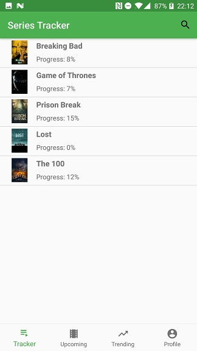
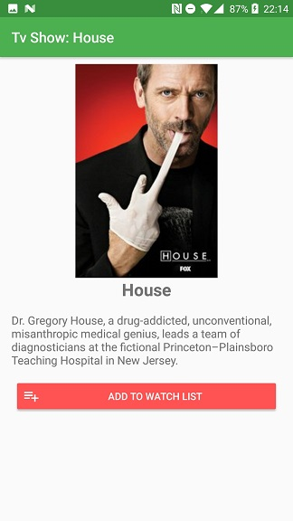
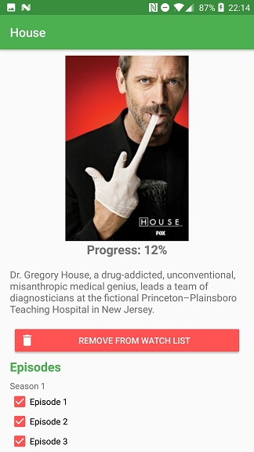
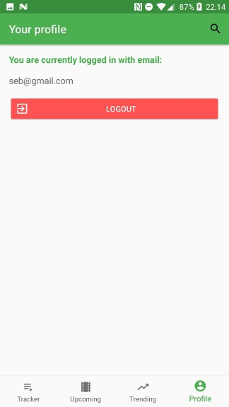
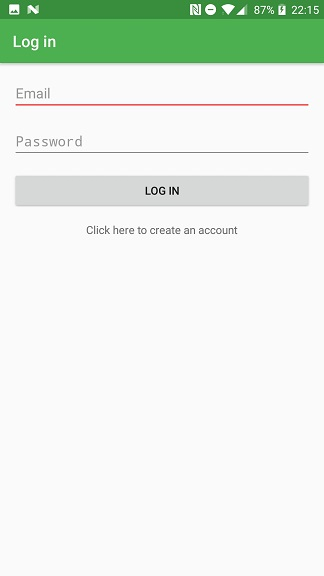

# Series Tracker

Native App Studio - Final project

By Sebastiaan Joustra

Ever wanted to continue watching that tv show you stopped watching a year ago, but can't remember where you left off? With this app, you can track the progress of the tv-shows you're watching. You can search for tv shows, and add them to your watch list.

## How to run

Open in Android Studio and run on a Android device with 7.0 or higher.

### Screenshots

## Code reviewed by Joeri Bes

[Link to the code I reviewed (Bram Smit)](https://github.com/Bram502/BramSmit-pset6)

## Future work
* Add two functionalities (initially planned before the deadline) also seen in the bottom navigation bar:
  * Upcoming: Based on the watched episodes, give the user reccomodations what to watch next. For example when a new episode gets released, or simply when the user is not done watching a tv show.
  * Trending: Give a few trending series that the user might like
* Make images load faster (caching? storing images in DB?)
* When the app is killed, the user will stay logged in when going back and returned to the home screen. But maybe some more state restoration would be useful.